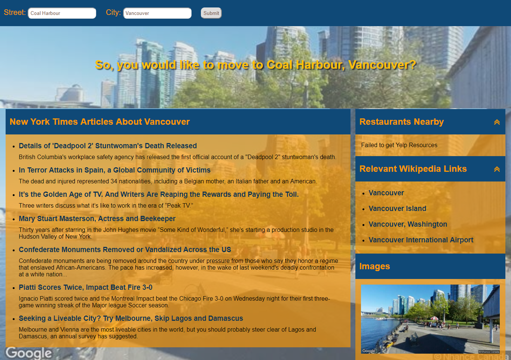

# Mini-Ajax-Project

This project gives allows you to select a city of your interest and displays following ifnormation:
* Google Street View Image in background
* New York Times articles of the location
* Relevant Wikipedia links
* Local restaurants via Yelp

## Gettign Started

* Download or clone the project
* Replace API Key information in config.js
* Open index.html to see the working project

### Prerequisites

* [Yelp Consumer Key](https://www.yelp.com/developers/documentation/v2/overview)
* [Google Map Street view](https://developers.google.com/maps/documentation/streetview/)

## Synopsis 

This is a small project to practice with API keys to pull data from another source using .ajax and .getJson requests. Also, error handling for the case where request fails. The steps and instructions are given in [Udacity 'Intro to Ajax' course](https://www.udacity.com/course/intro-to-ajax--ud110).

## How the script works?

There are two main script files - script.js and config.js.

Script.js contains the main functions that requests the data from the sources using API Keys. ;lb

### Setup

* **New York Times** [Documentation](https://developer.nytimes.com/) - API not required. NYT allows Cross-domain requests and data can be requested using .getJason()
* **Wikipedia** [Documentation](https://www.mediawiki.org/wiki/API:Main_page) - API not required. Wikipedia does not allow cross-domain requests. As a work around we can make a jsonp request. We can request using .ajax() with required parameters - Datatype: jsonp and a callback function to receive the data.
* **Google Map Street view** [Documentation](https://developers.google.com/maps/documentation/streetview/) - API required. Allows Cross-domain request(CORS) and can be implemented easily using the documentation.
* **Yelp** [Documentation](https://www.yelp.com/developers/documentation/v2/overview) - Consumer key required. Yelp is bit tricky. You need all the parameters listed in documentation. Most important of them is Oauth_signature, which is unique to each submitted request. There are many ways to do it, I used Node.js to generate it. Please see the section on Oauth_signaute for details.

#### Oauth_signature

* I used oauthSignature.generate() to generate the signature which is unique to each CORS request. This function requires Server environment. Node.js would be the easiest way to do so.
* You can download Node.js [here](https://nodejs.org/en/). [Steps](https://github.com/bettiolo/oauth-signature-js) to install NodeJS on local machine.
* Make sure to put oauth_signature_method: "HMAC-SHA1" (capital case)
* Token and Oauth_signautre are different. Following parameters are used to generate a signature:
  * Generates a RFC 3986 encoded, BASE64 encoded HMAC-SHA1 hash
  * encodedSignature = oauthSignature.generate(Method, url, parameters, consumer_Secret, token_Secret)
  * Generates a BASE64 encode HMAC-SHA1 hash
  * var signature = oauthSignature.generate(Method, url, parameters, consumerSecret, tokenSecret, { encodeSignature: true})
  * Method: GET
  * Url: where request is being sent
  * Parameters: Oauth_nounce (randomly generated string), Oauth_timestamp (unique timestamp for each request),see Yelp documentation for remaing parameters

**Error**

You may receive Invalid Signature or location error with the Yelp API. Error message is important and tells you which information is faulty.
* I used this link to test my API requests and to locate the fault - [Reference page](http://bettiolo.github.io/oauth-reference-page/)

## Error Handling

There can be many causes an error occurs like data not available. For these cases, I implement a request failure message. To achive this, I used setTimeout() and clearTimeout().

### API Keys Handling

API Keys are sensetive information. While working with Javascript, there is no robust way to hide the information in client-side single page application. One way is to save API keys on a server and call information in your application. Since this is only Front-end based application, I did not add keys. I used .gitignore to ignore the file with key data.

## Functionality

Enter street and city name in the search bar

#### Expected Result

* A street View image in page background and a section on the page
* A list of NY Times articles relevant to the location or city
* A list of Restaurants near the location
* A list of Wikipedia articles

**Here is a screenshot of working application:**

